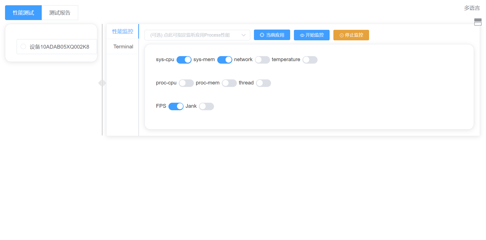
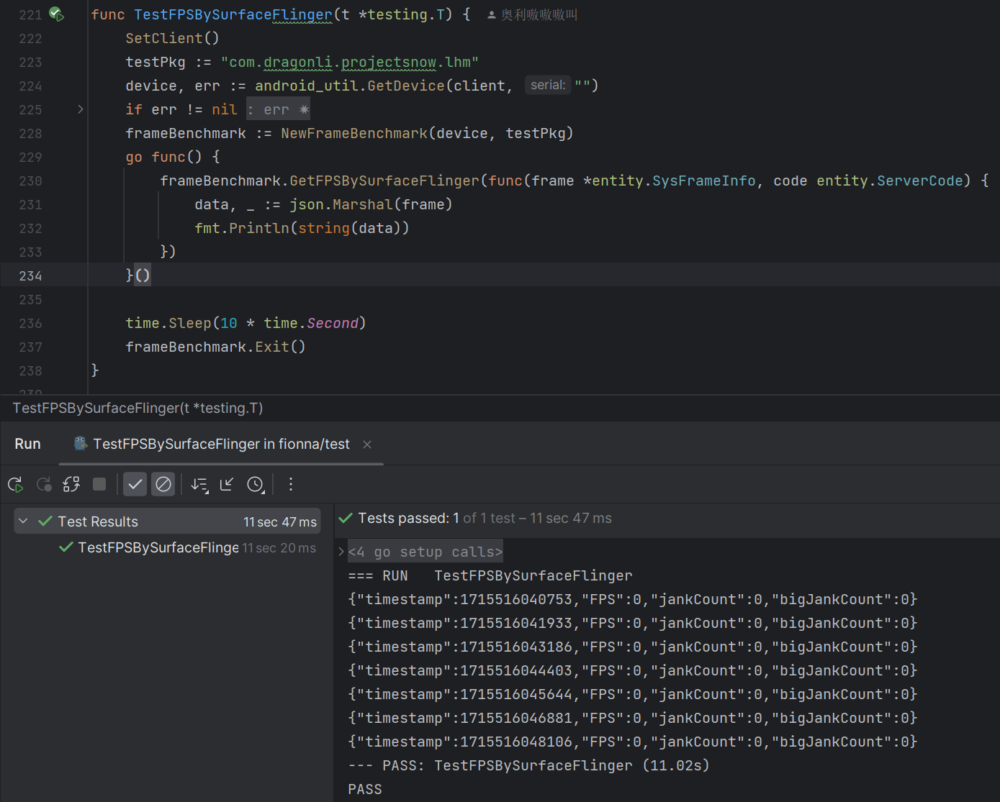
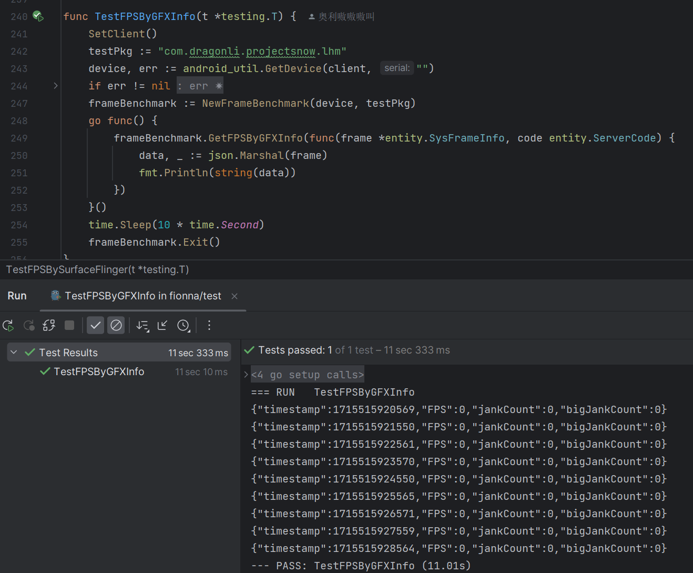

# Fionna

## Overview

Fionna is a performance monitoring tool designed for Android devices, with a focus on simplicity. It draws inspiration from Fionna Campbell in "**Adventure Time**".

Key features currently implemented include:

- Addressing the limitations of Android's SurfaceFlinger and GFXInfo solutions in capturing frame data for games and similar applications; refer to the frame benchmark for details
- Monitoring other performance metrics such as CPU, memory, temperature, network, etc.
- Device screen mirroring and touch input
- Test reporting
- Data export
- Data comparison

**Home**



**perf**


**Terminal**


**report**


## Frame Benchmark

The specific code is in test/frame_benchmark_test.go, where I defined three methods for comparison: TestFPSBySurfaceFlinger, TestFPSByGFXInfo, and TestFPSByFrameTool, corresponding to the ways of obtaining information from SurfaceFlinger, GFXInfo, and the new tool solution, respectively.

The testing was conducted on the iqoo11s device, running the software "**Snowbreak: Containment Zone**" (com.dragonli.projectsnow.lhm). The results obtained from the three methods are as follows:

**TestFPSBySurfaceFlinger**



**TestFPSByGFXInfo**



**OMSage Frame Tool**


You can see that using the OMSage Frame Tool to obtain performance data for Frames has better compatibility, making it suitable for most Android scenarios involving Frame performance collection.

**Please refer to the specific code for the usage of the OMSage Frame Tool and strictly follow its code logic. Any issues encountered during customization will not be addressed.**

## Usage

### Quickstart

Download the corresponding build artifact from Releases, and execute the corresponding target program after decompression.

Execute directly in the command line:

```
fionna
```

Then access the corresponding address in the browser: [http://127.0.0.1:3417](http://127.0.0.1:3417/)

### Command Line Mode

Fionna has a built-in simple command line mode, and you can input the following command to view instructions:

```
fionna --help
```

There are mainly two modes:

#### web mode

Execute the following command directly in the command line, and the program will directly start a web service. Then you can access the corresponding address: [http://127.0.0.1:3417](http://127.0.0.1:3417/)

```
fionna web
```

Of course, in web mode, you can also specify the SQLite DB file to use.

```
fionna web -d <db path>
# Example:fionna fionna web -d ./exapmle/my.db
```

#### cli-perf mode

Due to the strong dependency of web, a simple performance output mode is provided. Input the following command and you can get the corresponding performance data in the command line:

```
fionna cli-perf [flags]
# Example:fionna cli-perf --fps
```

**flags**

| Quick Usage | Option         | Parameter Type | Description                  |
| ----------- | -------------- | -------------- | ---------------------------- |
| -h          | --help         |                | Get help guide               |
| -p          | --package      | string         | Application package name     |
| -d          | --pid          | int            | Application PID (default -1) |
|             | --proc-cpu     |                | Get process CPU data         |
|             | --fps          |                | Get system FPS               |
|             | --jank         |                | Get system jank information  |
|             | --proc-mem     |                | Get process memory data      |
|             | --proc-threads |                | Get process thread count     |
| -s          | --serial       | string         | Device serial number         |
|             | --sys-cpu      |                | Get system CPU data          |
|             | --sys-mem      |                | Get system memory data       |
|             | --sys-network  |                | Get system network data      |

## Development

**When customizing this project, please adhere to the AGPL license!!!!**

**This project embeds a simple Vue frontend, so frontend setup must be done before development. If you need to customize development, follow the steps below first:**

- After cloning the project, navigate to the fionna-web directory

```
cd fionna-web
```

- Install frontend dependencies

```
npm install
```

- Generate build artifacts

```
npm run build
```

You can now proceed with project development according to your requirements.

## Notes

- ADB environment is required on the PC
- Application's CPU computation differs from regular calculations; the project uses the following metrics:https://blog.csdn.net/weixin_39451323/article/details/118083713

- Avoid occupying port 3417.

## Thank

- https://github.com/SonicCloudOrg/sonic-android-supply
- https://github.com/SonicCloudOrg/sonic-client-web
- https://github.com/electricbubble/gadb
- https://github.com/Genymobile/scrcpy